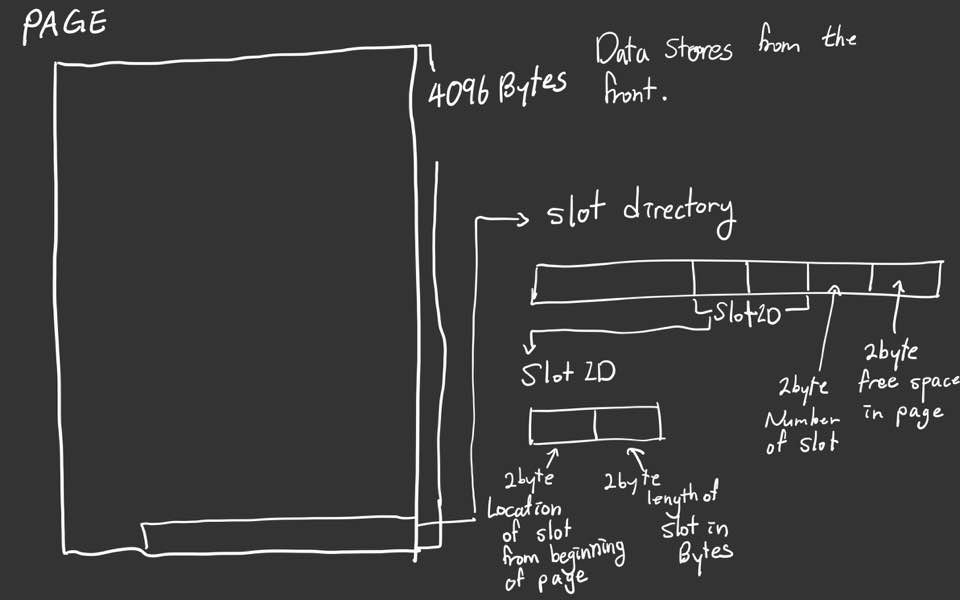

## Project 1 Report

### 1. Basic information
 - Team #: 11
 - Github Repo Link: https://github.com/UCI-Chenli-teaching/cs222-fall20-team-11
 - Student 1 UCI NetID: sehwanh
 - Student 1 Name: Sehwan Hong
 - Student 2 UCI NetID (if applicable):
 - Student 2 Name (if applicable):

### 2. Internal Record Format
- Show your record format design. 
    
    * First n bytes represent null field.
        * Null field represent which field are NULL (see below to gain more information)
    * Consecutive bytes stores the data of the records.
    * The Number of bytes stored for each data types are :
        * Int : 4 bytes
        * Float : 4 bytes
        * VarChar : 4 bytes (indication of length) + length of chars bytes

- Describe how you store a null field.  
    * The bytes of null field is saved as ceil(number of saved variables/8)  
        * Or it could be calculated like this:    
            bytes of null field = number of saved attributes // 8 + (number of saved attributes % 8 == 0 ? 0 : 1)
    * The left most bit on the null field indicates the first attributes and next bit represent the second attribute and so on.
    * If the bit is 0, it means that the value is present.
    * If the bit is 1, it means that it is NULL and data is not saved on the file.
    * If the there are more than 8 fields, the number of bytes for null field could increase.

- Describe how you store a VarChar field.  
    * The VarChar field contains two parts :
        * length of VarChar represented with unsigned int
        * actual char sequence
    * First four bytes represent the length of the VarChar stored in the record format
    * Consecutive bytes are actual char that is stored on the file 

- Describe how your record design satisfies O(1) field access.
    * If we know the length of each field and the base address, field access is done by adding the length of field and the base address
    * We check the null field for the reference, if the bit is 1, the field does not exists.
    * We check the recordDecriptor to access what is the type of the data to know how many bytes are stored.
    * Although accessing time is O(1), due to pointer access, The calculation for offset in worse case might take Omega(N)

### 3. Page Format
- Show your page format design.
    
    * Page consist of 4096 bytes.
    * The data starts from the beginning and grows toward the end.
    * The slot directory is saved from the back of the Page and grows towards the beginning of the page

- Explain your slot directory design if applicable.
    * Slot directory is saved as a sequence of 2 unsigned short.
    * The last 2 bytes of the Slot directory stores the available(free) space in the page.
    * The previous 2 bytes contains the number of Slot in the Page.
    * Next stores the sequence of slot information, Slot information is divided into two section:
        * The first section contains the offset, the position of slot from the beginning of the Page
        * The Second section contains the length of slot in bytes.
    * The sequence of the slot grows towards the beginning of the page.

### 4. Page Management
- Show your algorithm of finding next available-space page when inserting a record.
    * Algorithm of finding next available-space:
        * First, check from the first page if there is available space, store the record.
        * If there is no available space on the page, go to the next page and check availability.
        * If there is no available space on all of the pages, create a new page to store the record.

- How many hidden pages are utilized in your design?
    * There is only single page that are hidden.

- Show your hidden page(s) format design if applicable
    * Hidden Page only contains Four information:
        * readCount : number of read operation made by fileHandle
        * writeCount : number of write operation made by fileHandle
        * appendCount : number of append operation made by fileHandle
        * numberOfPages : number of accessible pages in the file
   * Each information is stored as unsigned integer which have 4 byte length.
   * The other data are saved with -1

### 5. Implementation Detail
- Other implementation details goes here.
    * There are several functions created for fileHandle class
    * generateHeader function saved the name of the file, call getHeader
    * getHeader functions read the file and save fileHandle attributes such as readPageCounter, writePageCounter, appendPageCounter, numberOfPages
    * saveHeader functions save the header from fileHandle attributes
    * configureHeader functions create the header from fileHandle attributes

### 6. Member contribution (for team of two)
- Explain how you distribute the workload in team.
    * I worked by myself.

### 7. Other (optional)
- Freely use this section to tell us about things that are related to the project 1, but not related to the other sections (optional)

- Feedback on the project to help improve the project. (optional)