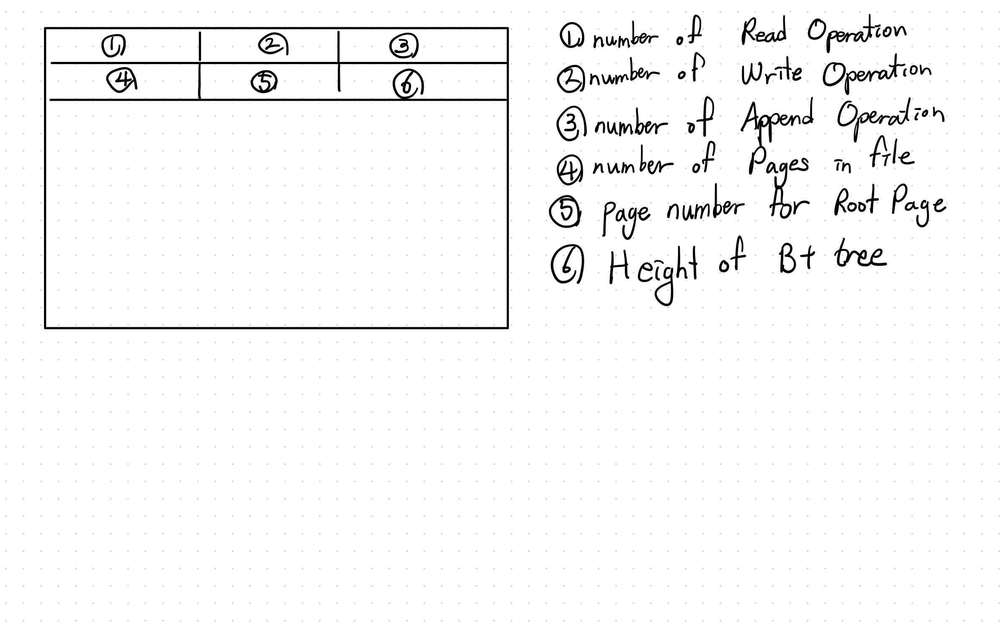
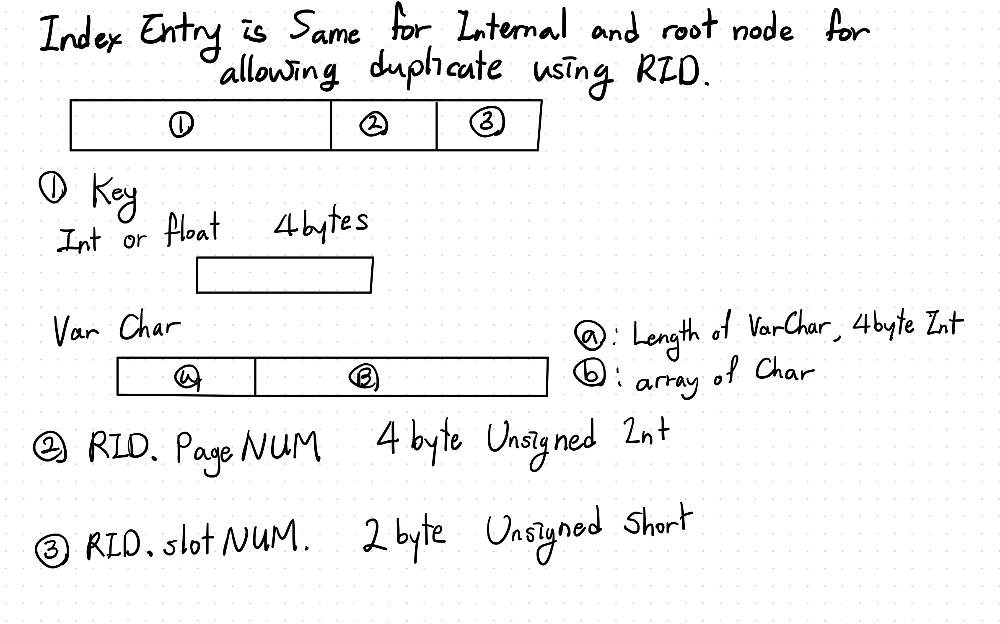
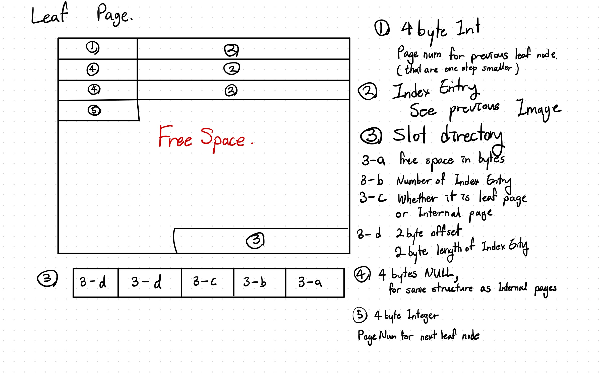

## Project 3 Report

### 1. Basic information
 - Team #: 11
 - Github Repo Link: https://github.com/UCI-Chenli-teaching/cs222-fall20-team-11
 - Student 1 UCI NetID: sehwanh
 - Student 1 Name:Sehwan Hong
 - Student 2 UCI NetID (if applicable):
 - Student 2 Name (if applicable):

### 2. Meta-data page in an index file
- Show your meta-data page of an index design if you have any. 

* For the meta data page, I have saved several information.  
* First 4 bytes are number of Reads on Index file  
* Second 4 bytes are number of Writes on Index file  
* Third 4 bytes are number of append on Index file  
* Fourth 4 bytes are number of pages on Index file  
* Fifth 4 bytes are page number for Root Page  
* Sixth 4 bytes are height of the B + tree  

### 3. Index Entry Format
- Show your index entry design (structure). 

* I have used same index entry for both Internal and leaf nodes because using same structure, same function could be used.

  - entries on internal nodes:  
  - entries on leaf nodes:

### 4. Page Format
- Show your internal-page (non-leaf node) design.

- Show your leaf-page (leaf node) design.

### 5. Describe the following operation logic.
- Split
    * For Splitting the Node, I have used two different operations.
    * When splitting the leaf Node, I just split them in half and copied the other half to the new page.
        * the first Entry of the right Node will go to higher level node to be inserted.
    * When splitting the Internal Node, I splitted them by checking where the index entry will be located.
        * If index entry will be located to the left Node, splitting the Internal Node will be skewed to the right,
                     where right side will have more nodes.
        * If index entry will be located to the right Node, splitting the Internal Node will be skewed to the left,
                     where right side will have more nodes.
        * After splitting them, remove the first Index entry from the right node and send them to the higher level node.

- Rotation (if applicable)

- Merge/non-lazy deletion (if applicable)

- Duplicate key span in a page
    * Duplicated key is calculated as different key since my Index entry is saving RID as well.
    Duplicated key and RID combined is used as a single Unique key.

- Duplicate key span multiple pages (if applicable)
    * Duplicated key is calculated as different key since my Index entry is saving RID as well.
        Duplicated key and RID combined is used as a single Unique key.
        Therefore, comparison operation works same as if duplicated key is a unique key.

### 6. Implementation Detail
- Have you added your own module or source file (.cc or .h)? 
  Clearly list the changes on files and CMakeLists.txt, if any.

* No

- Other implementation details:

### 7. Member contribution (for team of two)
- Explain how you distribute the workload in team.

### 8. Other (optional)
- Freely use this section to tell us about things that are related to the project 3, but not related to the other sections (optional)

- Feedback on the project to help improve the project. (optional)
 * Better discription is needed for JSON format. Using adding Spaces between RID would not be parsed correctly.
