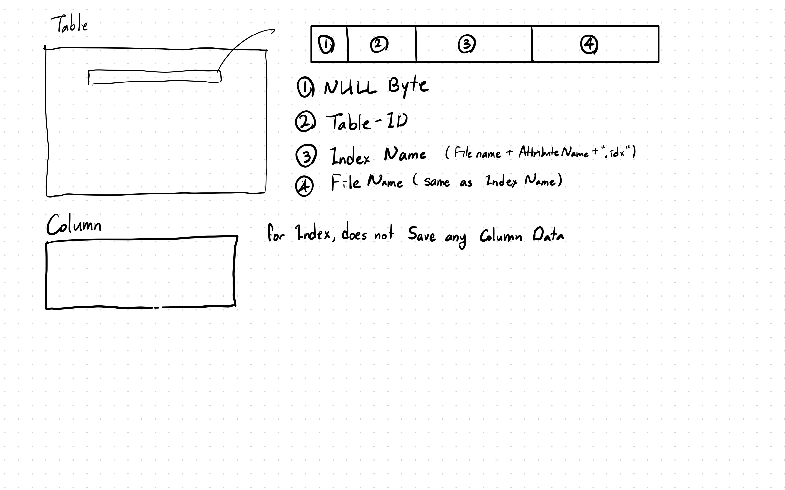

## Project 4 Report

### 1. Basic information
 - Team #: 11
 - Github Repo Link: https://github.com/UCI-Chenli-teaching/cs222-fall20-team-11
 - Student 1 UCI NetID: sehwanh
 - Student 1 Name:Sehwan Hong
 - Student 2 UCI NetID (if applicable):
 - Student 2 Name (if applicable):

### 2. Catalog information about Index
- Show your catalog information about an index (tables, columns).

 
 * Storing index is similar to storing normal File. Instead uses different IndexName and File Name;
 * For Index, do not need to store column data because access to index only happens inside the Relation Manager
 which controls all incidents that are related to Index Insertion, Index Deletion, Index Scan, and Index Update.

### 3. Filter
- Describe how your filter works (especially, how you check the condition.)

* Filter checks after getting the tuple from the iterator
* After receiving the tuple from iterator, It checks over the tuple if tuple meets the condtion.
* If tuple does not meet the filter condition, then new tuple is attained from iterator and repeats its step

### 4. Project
- Describe how your project works.

* Project checks after getting the tuple form the iterator
* After receiving the tuple from iterator, it goes over the attributes that iterator is outputting.
* While running the iterator, check if that attribute is projected.
* If the attribute is projected, then it is copied into output data.
* After project is finished, return End of File;

### 5. Block Nested Loop Join
- Describe how your block nested loop join works (especially, how you manage the given buffers.)

* Block Nested Loop has one big data that is size of number of Pages(given through input) * PAGE_SIZE(4096 Bytes).
* When Block of pages is created through iterating the left Iterator
* When the block if full or left Iterator returns End Of File, inserting to block is ended.
* When Block of Page is creating, using std::unordered_map, created the map using key( value of Attribute that is join ),
and the vector of Value(Value contains the type and data, location of data in Block of Pages).

* In getNextTuple, it gets tuple form right Iterator.
* Form the right Tuple, extract the value that is going to join.
* using the value as a key, get the vector of Value
* Join tuple of left(from the vector of Value which have location for data in block of page), and the right tuple
* Use the same vector of value until join with right tuple is finished.
* If join with right tuple is finished, then get next tuple from right Tuple;

### 6. Index Nested Loop Join
- Describe how your index nested loop join works.

* get left tuple from left Iterator.
* Using left Tuple get the attribute value for join.
* Using left attribute value, set Inclusive lower bound and inclusive upper bound for right Index Iterator
* Join left tuple and right tuple
* if right attributes gives End Of file, then get the left Tuple from left Iterator;
* if both iterator gives End of file, then return End of File. 

### 7. Grace Hash Join (If you have implemented this feature)
- Describe how your grace hash join works (especially, in-memory structure).

### 8. Aggregation
- Describe how your basic aggregation works.

 * Get Tuple form Iterator
 * from Tuple extract the value of aggregate Attribute.
 * check If the value is Integer or float, If Integer, change to float
 * for SUM, add all the float
 * for MIN, check if value is lower. If the value is lower, replace the Min
 * for Max, check if value is higher, If the value is higher, replace the Max
 * for Count, raise the counter
 * for AVG, get the sum, and count, divide the both.

- Describe how your group-based aggregation works. (If you have implemented this feature)

 * Create unorderedMap to store by the group.
 * Get Tuple form Iterator
 * from Tuple extract the value of group Attribute.
 * from Tuple extract the value of aggregate Attribute.
 * check If the value is Integer or float, If Integer, change to float
 * Use the value of Group Attribute as a Key.
 * if unordered_map does not have group Attribute in unordered map then set the float value to 0;
 * for SUM, add the value to unordered_map(groupAttrivuteValue)
 * for MIN, check if value is lower then unordered_map(groupAttrivuteValue). If the value is lower, replace the Min
 * for Max, check if value is higher then unordered_map(groupAttrivuteValue), If the value is higher, replace the Max
 * for Count, raise the counter for then unordered_map(groupAttrivuteValue)
 * for AVG, create Both Sum and count using GroupAttributeValue + "SUM" and GroupAttributeValue + "COUNT"
 * When displaying calculate the AVG by dividing SUM and COUNT
 
 * When getNextTuple is run, iterate over unordered_map

### 9. Implementation Detail
- Have you added your own module or source file (.cc or .h)?
  Clearly list the changes on files and CMakeLists.txt, if any.

NO other source used

- Other implementation details:

### 10. Member contribution (for team of two)
- Explain how you distribute the workload in team.

* Single handed work.

### 11. Other (optional)
- Freely use this section to tell us about things that are related to the project 4, but not related to the other sections (optional)

- Feedback on the project to help improve the project. (optional)
Need more detailed instruction about grace hash join. Also some problem on the code.